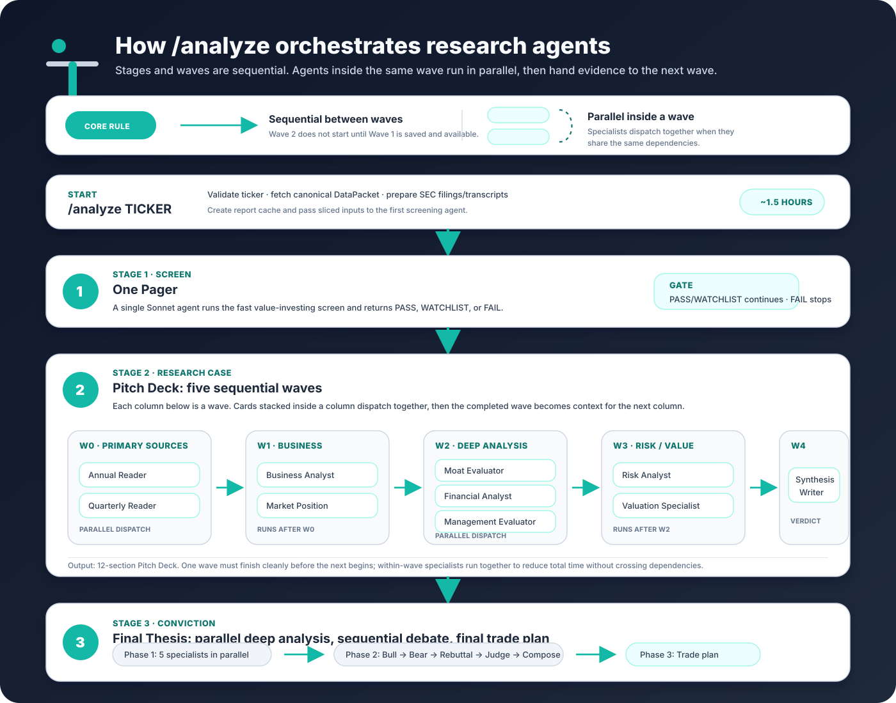

<div align="center">


# Thesis

**What Buffett and Graham would ask about a stock — answered, automatically.**

Thesis is an open-source CLI that runs a disciplined **Buffett & Graham value investing**
research pipeline on any public company. Type `/analyze TICKER` and it produces three gated
reports — **One Pager → Pitch Deck → Final Thesis** — as PDF, DOCX, and JSON, generated
locally on your own Claude Code subscription.


[**thesis-investing.com**](https://thesis-investing.com) &nbsp;·&nbsp; [Quickstart](#quickstart) &nbsp;·&nbsp; [What you get](#what-you-get) &nbsp;·&nbsp; [DataPacket](#why-the-datapacket-matters) &nbsp;·&nbsp; [Where your reports go](#where-your-reports-go) &nbsp;·&nbsp; [How it works](#how-it-works)

</div>

> **Not investment advice.** Thesis is an AI research tool for educational purposes only. Reports are generated by large language models and may contain errors, hallucinations, or outdated data. Always do your own research and consult a licensed financial advisor before investing. [Full disclaimer below.](#disclaimer)

---

## What you get

Three reports per ticker, each gating the next. A `FAIL` verdict stops the pipeline so you only spend research budget on companies that earn it.

| Stage | What it is |
|---|---|
| **1. One Pager** | A quick value-investing screen. Pass / fail in one page. |
| **2. Pitch Deck** | A 12-section research case — compounding, capital efficiency, capital allocation, resilience, and valuation. |
| **3. Final Thesis** | Conviction-level analysis with an adversarial **Bull / Bear / Rebuttal / Judge** debate and a trade plan. |

Every report is scored on the **4-pillar Thesis Score**: Compounding · Capital Efficiency · Capital Allocation · Resilience.

> 📄 **See real sample reports** at [thesis-investing.com](https://thesis-investing.com).

## Quickstart

### 1. Create a free account and get your API key

Thesis CLI is free and open source. To use the canonical DataPacket — the recommended data path for serious research — you need a **free, rate-limited API key**.

> **Don't skip this step.** The DataPacket is what gives every research agent the same high-quality, SEC-verified starting point. Without it, research may fail or fall back to more expensive, lower-confidence web search.

1. Go to **[thesis-investing.com](https://thesis-investing.com)** and create an account.
2. Open your dashboard and copy your API key (it looks like `thesis_live_...`).

### 2. Install

```bash
git clone https://github.com/kghoff/thesis-cli.git
cd thesis-cli
npm install
pip install -r requirements.txt
```

### 3. Configure

```bash
npm run setup
```

Paste your API key when prompted. This writes `~/thesis/config.json`:

```json
{
  "apiBaseUrl": "https://api.thesis-investing.com",
  "apiKey": "thesis_live_...",
  "defaultMode": "hosted-data"
}
```

### 4. Analyze

Open Claude Code in this folder and type:

```
/analyze AAPL
```

That's it. The full pipeline runs auto-pilot — no per-stage approvals.

## Why the DataPacket matters

The Thesis DataPacket is the structured financial dataset that powers the research pipeline. Think of it as the built-in replacement for wiring agents into external finance products like Morningstar, MarketWatch, or Yahoo Finance: those services ultimately source public-company fundamentals from SEC filings, and Thesis does the same, then packages the data into a consistent agent-ready format.

A DataPacket includes the core inputs agents need before they read filings and transcripts:

- Company identity and classification: ticker, CIK, SIC, exchange, sector, industry, and peer context.
- SEC-derived financial statements: income statement, balance sheet, cash flow, TTM values, and filing provenance.
- Quality and valuation inputs: growth rates, free cash flow, return metrics, debt metrics, key metrics, and Thesis Score pillars.
- Market and ownership context: peer quotes/metrics, guru holdings, insider activity, executive compensation, and dividend-related data when available.
- Source coverage: available filings, transcript availability, caveats, and timestamps so agents know what evidence exists.

This matters because an agent's output is only as good as its inputs. The DataPacket ensures two things:

1. **Consistency:** every pipeline starts from the same schema and the same type of data, so agents are not improvising different research foundations ticker by ticker.
2. **Quality:** the numbers are grounded in, and checked against, actual SEC filings instead of whatever a web search happens to find.

You can run the open-source CLI locally, but the intended workflow is to create a free account at **[thesis-investing.com](https://thesis-investing.com)** and import your Thesis API key during setup. Without the DataPacket, agents are effectively flying blind: they may miss critical facts, spend extra tokens searching the web, or produce lower-quality analysis.

## Where your reports go

Every run delivers your reports to **two places at once**:

1. **Your machine** — `~/thesis/reports/{TICKER}/` as `one-pager.pdf`, `pitch-deck.pdf`, and `final-thesis.pdf` (plus DOCX and JSON).
2. **Your account** — the same reports sync to your library at **[thesis-investing.com](https://thesis-investing.com)** for a clean reading and sharing experience.

Auto-sync happens automatically at the end of `/analyze` whenever an API key is configured. To push — or re-push — a single ticker to your account on demand:

```
/inject TICKER
```

## How it works

Thesis CLI is a thin orchestrator around Claude Code subagents. The `/analyze TICKER` command runs three gated stages in sequence, with each stage writing local artifacts before the next one starts.



### Agent team at a glance

- **Data first:** the CLI fetches a canonical DataPacket from the hosted **Thesis Data API**, slices only the fields each agent needs, extracts SEC filing sections, and loads bundled earnings transcripts.
- **Parallel where safe, sequential where necessary:** agents inside a wave run in parallel; later waves wait so they can inherit prior findings instead of duplicating work or contradicting earlier evidence.
- **Gated progression:** One Pager `PASS` or `WATCHLIST` advances to the Pitch Deck; `FAIL` stops early. The Pitch Deck must complete with a usable verdict before the Final Thesis begins.
- **Local generation:** Claude Code subagents run on your own subscription. Python renderers turn the final JSON into PDF and DOCX in `~/thesis/reports/{TICKER}/`.

| Stage | Agent flow | Why it exists |
|---|---|---|
| **1. One Pager** | 1 screening subagent | Fast reject / continue decision before spending deeper research budget. |
| **2. Pitch Deck** | Primary-source readers, then 5 waves: Business → Deep Analysis → Risk/Valuation → Synthesis | Builds the 12-section research case from filings, transcripts, market structure, financial quality, management, risk, and valuation. |
| **3. Final Thesis** | 5 deep-analysis agents in parallel, then **Bull → Bear → Rebuttal → Judge → Compose**, then Trade Plan | Pressure-tests the case and turns it into a conviction-level thesis with practical buy/sell/watch rules. |

A full `/analyze` run usually takes **about 1.5 hours** for a company that passes all gates. The Pitch Deck is normally the bottleneck because it fans out the most filing/transcript readers and specialist research agents.

```
/analyze TICKER
    |
    v
One Pager screen ── FAIL? stop
    |
    v
Pitch Deck waves ── 12-section research case + verdict
    |
    v
Final Thesis ── adversarial debate + trade plan
    |
    v
~/thesis/reports/{TICKER}/
    one-pager.pdf/.docx/.json
    pitch-deck.pdf/.docx/.json
    final-thesis.pdf/.docx/.json
    + optional sync to thesis-investing.com
```

Your subscription, your machine, your reports.

## Methodology

Buffett & Graham value investing, applied systematically. Thesis reads filings and transcripts through a long-term, quality-and-price lens: durable compounders, efficient capital, disciplined allocation, balance-sheet resilience — bought with a margin of safety. Public-domain methodology references: **Buffett, Graham, Lynch, Munger.**

<details>
<summary><b>Requirements</b></summary>

- **Node** 20 LTS or newer
- **Python** 3.11 or newer
- **Claude Code subscription** — see Subscription tier below
- **Free Thesis API key** — from [thesis-investing.com](https://thesis-investing.com)
- **Disk** ~5 GB for the repo (bundled earnings transcripts are ~72 MB)

Mac and Linux are tested. Windows works (file issues if not).

</details>

<details>
<summary><b>Subscription tier</b></summary>

Thesis runs on your Claude Code subscription — your account, your rate limits, your token budget.

| Stage | Subagent pattern | Tier |
|---|---|---|
| One Pager | 1 screening agent | **Pro** is fine |
| Pitch Deck | Primary-source readers plus 8 specialist roles across 5 waves | **Max** strongly recommended |
| Final Thesis | 11 dispatches across deep analysis, debate, compose, and trade plan | **Pro** workable, **Max** smoother |

The Pitch Deck stage is the bottleneck — it fans out the most filing/transcript readers and specialist research agents, and Pro-tier accounts may hit usage limits mid-run. On Pro, generate One Pagers first and only spend Pitch Deck / Final Thesis budget on tickers that pass.

</details>

<details>
<summary><b>Data sources</b></summary>

- **Thesis Data API** — canonical DataPacket for prices, estimates, peer quotes, dividend history, and financials.
- **SEC EDGAR** — public filing sections fetched and extracted locally for the agents.
- **Bundled transcripts** — earnings call transcripts for ~492 of the S&P 500 (~72 MB) ship in the repo at `./transcripts/`. No setup.
- **Alpha Vantage** — optional transcript fallback only if you supply an Alpha Vantage key in your environment.

</details>

<details>
<summary><b>Privacy</b></summary>

- No telemetry, no analytics.
- The Thesis API receives the ticker symbol and returns a DataPacket. Report generation stays local.
- Network calls during a run: Thesis Data API (DataPacket), SEC EDGAR (public filings), Anthropic (LLM via your Claude Code subscription), optional Alpha Vantage fallback, and — when configured — report sync to your thesis-investing.com account.
- See [PRIVACY.md](PRIVACY.md) for the full breakdown.

</details>

## Contributing

See [CONTRIBUTING.md](CONTRIBUTING.md). Note: agent prompts in `agents/` follow an issue-only PR policy.

## License

MIT © 2026 Kyle Hoff. See [LICENSE](LICENSE).

## Disclaimer

> **Not investment advice.** Thesis is an AI-powered research tool for educational and informational purposes only. Reports are generated by large language models and may contain errors, hallucinations, outdated data, or misinterpretations of financial filings. Nothing produced by Thesis constitutes investment advice, financial advice, legal advice, tax advice, or a recommendation to buy, sell, or hold any security. The author is not a registered investment advisor. Always conduct independent research and consult a qualified financial advisor licensed in your jurisdiction before making investment decisions. You assume all risk for any decisions made using this tool or its outputs. Past performance is not indicative of future results.
>
> Thesis is not affiliated with, endorsed by, or sponsored by any investment methodology, author, fund, or organization referenced or implied in its outputs. All trademarks and methodologies referenced belong to their respective owners.
